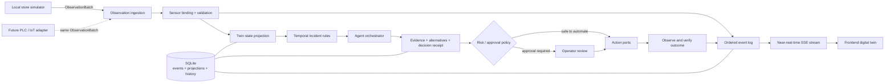

# Agentic Store backend architecture

## Purpose and current scope

The Agentic Store backend is a local-first operational twin for a physical retail store. It turns live observations into a consistent store state, detects operational incidents, proposes coordinated responses, applies safe actions, and verifies outcomes. Its contracts are designed for a lively, near-real-time 3D client without coupling that client to any sensor vendor or cloud.

This iteration deliberately has no AWS runtime dependency. It runs locally with an in-process simulator and SQLite. AWS or another cloud can be added later through adapters without changing the store model or frontend event contract.

The backend owns facts, state transitions, incidents, decisions, approvals, and tasks. The frontend renders those facts; it must not synthesize operational data.

## System shape



The backend is separated into replaceable boundaries:

- `packages/agentic-store-contracts` is the shared semantic and transport contract.
- `server/agentic-store/domain` defines the store catalog, bindings, detection rules, and decision planning.
- `server/agentic-store/application` coordinates ingestion, incidents, agent activity, approvals, actions, and verification.
- `server/agentic-store/infrastructure` supplies local persistence and event delivery.
- `server/agentic-store/simulation` is a realistic development data source and action target, not a second domain model.
- The HTTP layer exposes the application under `/api/agentic-store` and streams ordered events to clients.

## One semantic contract for simulator and PLC data

The simulator and a future PLC adapter meet at `ObservationBatch`. A source reports a store ID, stable source/session identity, monotonically increasing source sequence, sample time, and tag/value/quality readings. It does not address 3D meshes or frontend components.

`SensorBinding` records map source-specific tags onto semantic properties such as:

- `cooler-dairy-01 / thermal.airTemperatureC`
- `shelf-produce-01 / inventory.fillRatio`
- `checkout-cluster-01 / queue.waitSeconds`
- `aisle-03 / accessibility.clearanceM`

Ingestion validates types and ranges, applies configured scale/offset transformations, rejects unknown tags, ignores stale source sequences, and produces normalized observations. This is the seam for real PLC data: the adapter translates the transport or tag namespace, while the incident engine, agent logic, persistence, SSE feed, and frontend stay unchanged.

Each semantic property has one authoritative binding. When a deployment file
maps a real PLC/gateway tag to a property, that mapping replaces the default
simulator binding for that property; the simulator can still animate and fill
unmeasured parts of the store without overwriting measured facts.

Bindings also declare a freshness window. A one-second server sweep uses receipt
time—not potentially accelerated simulator sample time—to mark overdue values
`STALE`, emit a twin patch, and open a store telemetry incident. Fresh evidence
clears that incident through the same observe-and-verify loop. An intentionally
paused simulator is reported as `PAUSED` rather than misclassified as failed.
Bindings can separately cap accepted PLC sample age; delayed historical values
are rejected before they can trigger live operational actions.

Temporal rules use the simulator's virtual sample clock when all of their
evidence is simulator-owned, so accelerated demos preserve trigger and recovery
hysteresis. PLC and mixed-source rules use server receipt time instead of
trusting a device clock.

The `StoreManifest` is the stable bridge into visualization. Every entity has semantic properties and a stable `sceneNodeId`; many also have a physical pose and dimensions. Sensor addresses never leak into the rendering layer.

## Near-real-time read model

A client starts with one bootstrap read and then follows Server-Sent Events (SSE):

1. Bootstrap supplies the manifest, current twin snapshot, active incidents, decisions, tasks, simulator state, capabilities, and the current event sequence.
2. The SSE connection delivers ordered `StoreEventEnvelope` records such as twin patches, presence frames, incident changes, agent activity, decision changes, task changes, and simulator status.
3. Every persisted event has a monotonic sequence. A reconnecting client resumes after its last event ID and deduplicates by sequence. If its cursor is older than the bounded replay window, the stream returns `EVENT_CURSOR_EXPIRED` and the client reloads bootstrap.
4. Shopper presence is sampled into the durable stream at 1 Hz for smooth client interpolation without writing every 250 ms simulation tick. Operational facts and workflow changes remain available in projections after event replay expires.

SSE is intentionally simple for the first version: it is browser-native, works well for server-to-client store updates, supports reconnect/resume, and avoids a cloud broker. Command and review requests continue to use ordinary HTTP.

## Persistence and recovery

SQLite stores both the append-only operational event log and query-friendly projections:

- current twin property state;
- bounded property history;
- incidents and their evidence;
- agent decisions and approval receipts;
- operations tasks;
- ordered store events for replay and SSE catch-up.

Event append and projection updates are performed together where a fact must be atomic. WAL mode allows the local event stream and HTTP reads to continue while observations arrive. Retention applies to high-volume history; durable workflow records remain available for explanation and auditing.

SQLite is the local implementation, not a domain constraint. A future persistence adapter can target a managed relational, time-series, or event service without changing contracts exposed to the UI.

## Agent behavior and safety

The agent loop is explicit and observable:

```text
observe -> detect -> analyze evidence -> compare alternatives -> propose
        -> approve when required -> act -> observe again -> verify
```

An incident contains the exact entity properties used to evaluate it. A decision contains a concise explanation, confidence, alternatives, risks, benefits, selected actions, provider identity, and evidence references. Agent activity reports public phases and short operational summaries.
Incident records separately identify the opening-time `triggerSourceIds`, so
contextual evidence from another source cannot be mistaken for the measurements
that opened the rule. Reset safety independently captures current causal
ownership immediately before changing the simulator session.

These are decision receipts, not chain-of-thought. The backend never exposes hidden reasoning, internal prompts, or private scratch work. The UI should show evidence, policy, alternatives, action status, and measured outcome instead.

Deterministic planning is always available, so the store remains functional without a model. An optional OpenAI-compatible local model can improve summaries while the deterministic provider remains the fallback. Remote model endpoints are denied by default unless explicitly enabled.

Actions are policy-gated:

- Low-risk actions can execute automatically in the simulator.
- Medium- or high-risk actions wait for an operator decision.
- Approval/rejection records include actor, time, and optional note.
- Actions target ports, not infrastructure SDKs.
- Completion is not success by assertion: the orchestrator waits for new sensor evidence and records verification.

Every action receipt identifies its executor as `SIMULATOR`, `LOCAL_WORKFLOW`,
or `EXTERNAL_ADAPTER`. PLC-owned entities are never changed by the simulator:
task-backed work can be queued locally, while unsupported digital/physical
commands fail closed until a real adapter exists. If an incident recovers before
approval, pending actions are cancelled and the decision becomes `SUPERSEDED`.
Resetting the simulator likewise starts a clean source session and supersedes
only workflows whose causal trigger measurements came from that simulator and
whose condition no longer holds after the clean baseline. It never silently
verifies or clears a surviving PLC breach. Trigger and recovery timers are
reset only when that source actually participates in the corresponding
predicate, and late action acknowledgements cannot overwrite the resulting
terminal decision.

In this local iteration, action effects are limited to the simulator. A real equipment adapter must add authentication, authorization, idempotency, command acknowledgement, timeouts, interlocks, and an explicit allowlist before physical writes are enabled.

## Insights adopted from the Agentic Store concept

The supplied [AWS Agentic Store article](https://aws.amazon.com/blogs/industries/the-agentic-store-how-ai-orchestration-will-revolutionize-physical-retail/) highlights a useful architectural idea: a store becomes agentic when inventory, equipment, workforce, customer experience, and digital availability stop operating as silos. One incident can require several coordinated responses—for example, protect cold-chain inventory, update availability, create maintenance work, and reprioritize staff—followed by outcome verification.

This backend adopts that operating model while remaining vendor-neutral:

- Build the common operational foundation first.
- Add rules and intelligence on top of stable facts.
- Coordinate multiple bounded actions instead of building isolated alerts.
- Keep latency-sensitive observation and safety paths local.
- Preserve human approval for consequential actions.
- Add deeper analytics and cloud-scale orchestration incrementally.

The article mentions AWS services as one way to implement the later phases. None of those services is claimed or required by the current code.

## Future adapter boundaries

| Boundary | Local implementation now | Future implementation without contract changes |
| --- | --- | --- |
| Sensor input | Deterministic store simulator | PLC gateway, OPC UA/MQTT bridge, IoT rule consumer, or computer-vision event adapter |
| Event delivery | In-process event bus + SSE | Durable broker or managed event stream behind the same ordered envelope |
| Operational persistence | SQLite | Managed relational/event database and time-series store |
| Agent summaries | Deterministic or local OpenAI-compatible provider | Governed hosted model provider |
| Action execution | Simulator action target | Inventory, workforce, maintenance, commerce, checkout, or equipment connectors |
| Analytics | Local property history and incident records | Warehouse/lake, fleet benchmarking, forecasting, anomaly models, and BI |
| Identity and policy | Local development boundary | Workforce identity, roles, store/region tenancy, audit export, and fine-grained policy |

AWS can later fill some of these roles, but cloud adoption should be an adapter decision, not a rewrite. The first useful AWS step would normally be secure ingestion and hosting; databases, analytics, AI, and fleet orchestration can then be added only when scale or business value justifies their cost.

## Non-goals for this iteration

- No AWS provisioning, SDK calls, cloud database, or hosted model is required.
- No direct browser connection to PLCs, MQTT topics, or equipment controls.
- No hidden reasoning or chain-of-thought API.
- No fabricated frontend telemetry or optimistic action success.
- No claim that the local authorization boundary is production-ready.
