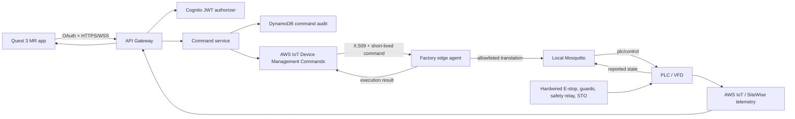

# Quest Motor Control - Architecture Foundation

Status: proposed foundation  
Scope: Quest 3 supervisory HMI, AWS control plane, factory edge agent, simulator  
Production actuation: disabled until commissioning

## Objective

Build one Quest application that works in three environments:

1. `Local` - Quest talks to a motor simulator on the developer laptop.
2. `Staging` - Quest talks to authenticated AWS APIs backed by simulated equipment.
3. `Production` - Quest talks to the same AWS APIs, which dispatch validated commands
   to a factory edge agent that maps them to the existing local `plc/control`
   firmware contract.

The Quest application is a supervisory HMI. It is not a safety controller, an
emergency stop, or a direct MQTT/PLC client.

## Target architecture



## Trust boundaries

- Quest sends operator intent only: equipment ID plus `START` or `STOP`.
- API Gateway authenticates the operator and validates route scopes.
- The command service creates trusted command IDs, actor identity, timestamps,
  expiry, and audit records.
- AWS transports the command to one registered edge device.
- The edge agent owns the only mapping from logical equipment to local MQTT.
- The PLC/VFD remains the final authority and owns physical interlocks.
- The UI renders reported state, never optimistic state.

## Local mapping

The current firmware mapping remains behind the edge boundary:

```text
MOTOR-01 + START -> plc/control {"boardA_relay_motor":1}
MOTOR-01 + STOP  -> plc/control {"boardA_relay_motor":0}
```

Neither the Quest nor the public API accepts an MQTT topic or raw relay field.

Use different cloud and factory topic namespaces. Do not mirror `plc/control`
up to AWS and subscribe it back down, because that can create echoes or loops.
AWS IoT Device Management Commands is the preferred production transport. A
versioned request/result MQTT transport may be used behind the same interface
for the initial simulator.

## Non-negotiable invariants

1. No retained actuation messages.
2. A `START` has a server-generated short expiry and is rejected when stale.
3. Reconnect never retries or resumes `START`.
4. Commands are idempotent by `commandId`.
5. Only one command may be in flight per equipment item.
6. `SUCCEEDED` means PLC/VFD confirmation, not MQTT publish acknowledgement.
7. Stale telemetry, unknown equipment, expired auth, open interlocks, or lost
   anchor disable `START`.
8. Operational `STOP` is clearly labelled as not an emergency stop.
9. Hardwired safety works independently of Quest, Wi-Fi, AWS, Node, and MQTT.
10. Production control stays feature-flagged off until signed commissioning.

## Additive repository structure

The existing React dashboard stays at the repository root. New work is added
without moving or rewriting it:

```text
apps/
  quest-mr/                  # Unity project, opened directly from Unity Hub

packages/
  control-contracts/         # OpenAPI, JSON Schema, fixtures, generated clients
  control-domain/            # Command state machine and equipment policy

lambda/
  command-create/
  command-dispatch/
  command-result/
  command-get/
  equipment-state/

edge/
  command-agent/             # AWS downlink + local plc/control adapter
  motor-simulator/           # Safe remote development target

infra/
  cdk/                       # Auth, control plane, telemetry, observability

tests/
  control/
    unit/
    contract/
    integration/
    e2e/
    hardware-in-loop/

docs/
  quest-control/
```

See [BACKEND_STRUCTURE.md](./BACKEND_STRUCTURE.md) and
[FRONTEND_STRUCTURE.md](./FRONTEND_STRUCTURE.md).

## Delivery gates

### Gate 1 - Contracts

- OpenAPI and JSON Schemas reviewed.
- Command lifecycle and reason codes frozen as version `v1`.
- TypeScript and C# fixtures agree.

### Gate 2 - Remote simulator

- Full Quest experience works from home.
- Simulator covers normal operation, faults, stale telemetry, duplicates,
  delay, dropped acknowledgement, and reconnect.
- No production AWS or factory access is required.

### Gate 3 - AWS staging

- Cognito login and scoped APIs work.
- AWS command transport targets simulated equipment only.
- Audit, metrics, alarms, and command-result correlation are verified.

### Gate 4 - Factory dry run

- Edge agent receives AWS commands but does not publish `plc/control`.
- Equipment registry, telemetry freshness, and interlock readings are verified.

### Gate 5 - Commissioning

- Supervised operational `STOP` first.
- Supervised `START` only after safety/controls approval.
- Network-loss, duplicate, expiry, reboot, and no-confirmation tests pass.

## Next implementation slice

The first code slice should contain only:

1. `packages/control-contracts` with `v1` request/result/state schemas.
2. `packages/control-domain` with the deterministic command state machine.
3. `edge/motor-simulator` with repeatable scenario files.
4. `apps/quest-mr` created from Unity's Mixed Reality template with a component
   gallery scene and no networking secrets.

This produces a useful, testable remote-development loop before AWS command
dispatch or real PLC actuation exists.
